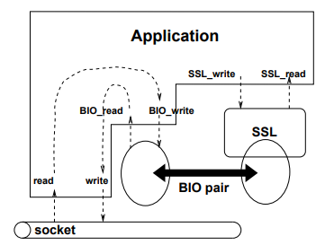

# Chat-Sample-using-DTLS

This is a sample application to demonstrate dtls to use Bio Pair.

## Description
UDP uses only one socket for TX and RX. In other words, there is no session management.
The server will sendto() again using the socket descriptor received during recvfrom().

However, SSL must establish a session and exchange data after completing the key exchange handshake.

so upgrade of legacy udp to dtls does not so simple.

To solve this problem, this sample uses a method called BIO Pair.
This is to create 2 BIOs. One is the general socket BIO, and the other is the SSL BIO.
These BIOs are interconnected.

For example, when a packet arrives at the socket during RX, it calls UDP function recvfrom() to get encrypted data. then it writes it to the BIO_network to decrypt.
if you read this again in BIO_nternal (SSL_read),  the decoded plain text data is contained.
In the case of TX, the reverse is performed.



## Build & Usage

```python
$ make
gcc -Wall -g  -c dtlsplex.c
udpserver
gcc -o udpserver -Wall -g  serv.o dtlsplex.o peer.o -lssl -lcrypto -ldl -ldl -lpthread
udpcli
gcc -o udpcli -Wall -g  cli.o dtlsplex.o peer.o -lssl -lcrypto -ldl -ldl -lpthread
```
server
```python
# ./udpserver
```


Client
```python
# ./udpcli 192.168.1.152 2053
```


## Note and Prerequisites

* Server and client mutually authenticate each other
* Cipher Suite uses tls_dhe_rsa_with_aes_256_gcm_sha384
* openssl-1.0.2d or more need

## Acknowledgements
The basic idea and important functions were obtained from the paper below.
http://www.lafraze.net/nbernard/doc/dtls/dtls.pdf

                                                         
